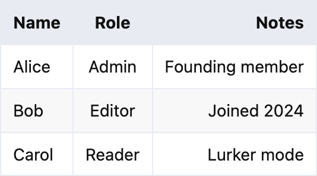
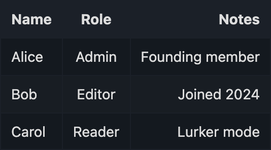
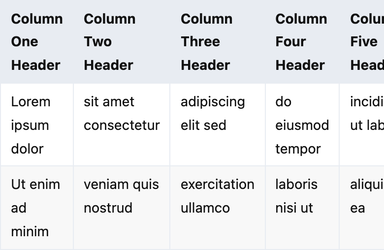
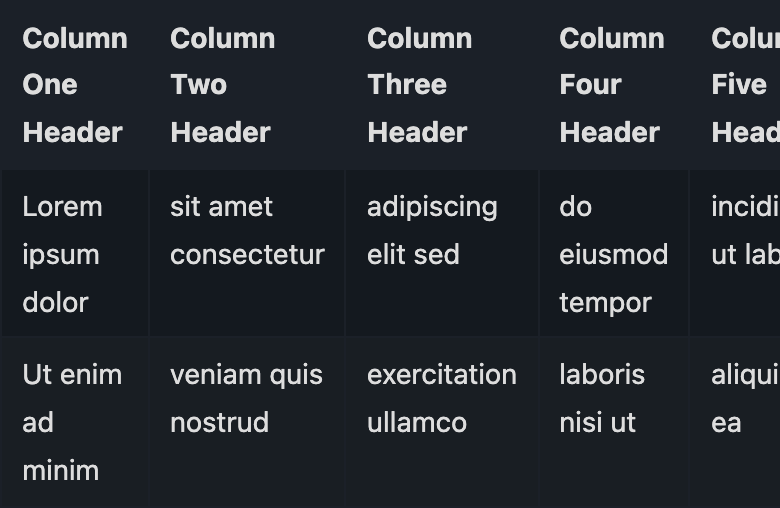

# Markdown Tables for Flarum 2.0

[](LICENSE)
[](https://packagist.org/packages/ekumanov/flarum-ext-markdown-tables)
[](https://packagist.org/packages/ekumanov/flarum-ext-markdown-tables)
[](https://github.com/ekumanov/flarum-ext-markdown-tables/actions/workflows/backend.yml)

Adds proper markdown table support to Flarum 2.0, both in rendered posts and inside the [FriendsOfFlarum Rich Text](https://discuss.flarum.org/d/38789-friendsofflarum-rich-text-wysiwyg) WYSIWYG editor.

This is a Flarum 2.0 port of [askvortsov/flarum-markdown-tables](https://github.com/askvortsov1/flarum-markdown-tables) — the original Flarum 1.x extension was built on `askvortsov-rich-text` (ProseMirror-based), which has been replaced in 2.0 by `fof-rich-text` (Tiptap v3-based). The port was made with [Claude Code](https://claude.com/claude-code).

## Screenshots

|  Light  |  Dark  |
|---------|--------|
|  |  |

A table that's wider than the post column gets a horizontal-scroll wrapper on narrow viewports, instead of being forced to crush each cell:

| Wide table on mobile (light) | Wide table on mobile (dark) |
|------------------------------|-----------------------------|
|  |  |

## What you get

Type a standard pipe table in the composer:

```
| Name  | Role   | Notes           |
|-------|:------:|----------------:|
| Alice | Admin  | Founding member |
| Bob   | Editor | Joined 2024     |
| Carol | Reader | Lurker mode     |
```

…and your post renders it as a proper, styled HTML table — with header row, column alignment from the `:---:` markers, alternating row backgrounds, and horizontal scrolling when the table is wider than the post column.

## Features

- **Pipe-table parsing** — standard GitHub-flavoured Markdown syntax. Handles left/center/right column alignment via `:---`, `:---:`, and `---:` separators.
- **Rich-text editor integration** — when [`fof/rich-text`](https://github.com/FriendsOfFlarum/rich-text) is enabled, an "Insert table" button appears in the composer toolbar. Set columns and rows, click insert, type into cells.
- **Markdown round-trip** — tables created in the WYSIWYG editor serialize back to clean pipe-table markdown, so the post stays human-readable in the database and editable in plain mode.
- **Responsive overflow** — wide tables get wrapped in a horizontally-scrolling container so they never blow out narrow viewports.
- **Theme-aware** — borders, header background, and zebra striping use Flarum's CSS custom properties, so tables follow your light/dark scheme automatically.
- **No configuration** — install, enable, done.
- **Works without `fof/rich-text`** too — if you don't use the WYSIWYG editor, posts still parse and render markdown tables correctly.

## Requirements

- **Flarum 2.0** (tested against 2.0.0-rc.1)
- **PHP 8.2+**
- Optional: **`fof/rich-text` 2.0+** for the WYSIWYG insert button. Markdown rendering works without it.

## Installation

```bash
composer require ekumanov/flarum-ext-markdown-tables
php flarum cache:clear
```

Then enable the extension in the admin panel under **Extensions > Markdown Tables**.

## Updating

```bash
composer update ekumanov/flarum-ext-markdown-tables
php flarum cache:clear
```

## How it works

### Backend

The PHP side is small. We register an `Extend\Formatter` callback that enables the s9e/text-formatter [PipeTables](https://s9etextformatter.readthedocs.io/Plugins/PipeTables/) plugin:

```php
(new Extend\Formatter())
    ->configure(function (Configurator $config) {
        $config->PipeTables;
    });
```

PipeTables is already shipped inside `s9e/text-formatter` (a Flarum core dependency), so this adds zero new code paths to the parser — it just turns on a feature that's already there.

### Frontend (forum, always-on)

Two small things happen on the forum side regardless of which editor you use:

1. **Wrap rendered tables for horizontal scroll.** PipeTables emits bare `<table>` elements; without a wrapper, a table wider than the post column overflows or breaks layout. We hook into `Post#oncreate`/`onupdate` and wrap each `<table>` in a `<div class="markdown-table-wrapper">` with `overflow-x: auto`. The wrap is idempotent — a `data-markdown-tables-wrapped` attribute prevents double-wrapping when Mithril rerenders.

2. **Style the table.** Borders use `var(--control-bg)`, header rows pick up `var(--control-bg)` as background, even rows get a subtle striping. Everything goes through Flarum 2's CSS custom properties so it follows the theme automatically.

### Frontend (composer, when `fof/rich-text` is enabled)

This is where most of the code lives, because Tiptap doesn't know about pipe tables out of the box. The integration happens in four pieces:

#### 1. Tiptap node specs

`fof/rich-text` exposes `Node` from `@tiptap/core` via `flarum.reg.get('fof-rich-text', 'common/tiptap/tiptap')`. We use that to define six nodes:

```
table > tableHead > tableRow > tableHeader   (one head row)
      > tableBody > tableRow > tableCell     (zero or more body rows)
```

Each node has standard `parseHTML` / `renderHTML` rules. Cell nodes carry an optional `style` attribute that holds the alignment (`text-align: left|center|right`), parsed from the markdown separator and replayed when the cell renders.

The `Node` constructor is captured lazily, after `fof/rich-text`'s async chunk loads — resolving it at module load time would crash, because the chunk hasn't loaded yet. We push our setup work onto `TextEditor.prototype.oninit`'s `_loaders` array, which Tiptap's editor awaits before construction.

#### 2. Markdown parser tokens

`fof/rich-text`'s `MarkdownParserBuilder` uses `markdown-it` in CommonMark mode, which has the `table` rule disabled. We patch its prototype to:

- Call `.enable('table')` on the tokenizer.
- Add token-to-node mappings for `table`, `thead`, `tbody`, `tr`, `th`, `td`. The `th`/`td` mappings lift the `style` attribute from the markdown-it token onto the node attributes — that's how alignment survives parsing.

#### 3. Markdown serializer

When the user types a table in the WYSIWYG editor and hits submit, Tiptap calls our serializer to turn the doc back into markdown. We hook `MarkdownSerializerBuilder.prototype.buildNodes` and add a `table` handler that walks `tableHead` → `tableRow` → `tableHeader`, emits the header pipe row, then the alignment separator row (`| --- | :---: | ---: |`), then each `tableBody` row.

Pipe characters that appear inside a cell are escaped to `\|` so they don't break the table syntax.

#### 4. Toolbar dropdown

`InsertTableDropdown.js` is a Mithril component that extends Flarum's `Dropdown`. Its menu has two faces:

- **Outside a table** — a small form with "columns" and "rows (including header)" inputs and an "Insert table" button. Clicking it dispatches our `insertTable(rows, cols)` Tiptap command, which builds a fresh `table` node populated with single-space cells (PipeTables drops empty cells, so the space keeps the structure intact through round-trips).
- **Inside a table** — a context menu with "Insert/delete row before/after", "Insert/delete column before/after", and "Delete table".

The button is added to the toolbar via `extend(TiptapMenu.prototype, 'items', …)`, so it sits alongside Bold, Italic, Image, etc.

### A note on bundle isolation

Our extension does *not* bundle `@tiptap/extension-table`. Instead we built minimal Node specs ourselves and reused `fof/rich-text`'s exposed `@tiptap/core` Node constructor. This avoids shipping a duplicate copy of Tiptap-core or `prosemirror-tables` — nodes share the same Tiptap instance the editor is using, so `instanceof` checks and schema lookups all line up.

The trade-off: we don't get column-resize handles or the cell-selection plugin you'd get from `@tiptap/extension-table`. For a markdown forum, that's the right trade — pipe tables can't express column widths anyway, so column-resize would only set state that disappears on save.

## Limitations

- **Single-column tables don't render.** This is a PipeTables limitation, not ours — GitHub-flavoured Markdown's pipe-table grammar requires at least two columns.
- **Cells contain inline content only.** No nested block elements (lists, quotes, code blocks) inside cells. This matches the standard pipe-table specification.

## Links

- [Packagist](https://packagist.org/packages/ekumanov/flarum-ext-markdown-tables)
- [GitHub](https://github.com/ekumanov/flarum-ext-markdown-tables)
- [Original Flarum 1.x extension](https://github.com/askvortsov1/flarum-markdown-tables) by Alexander Skvortsov

## License

MIT — see [LICENSE](LICENSE). Original copyright notice retained for the Flarum 1.x extension this is ported from.
